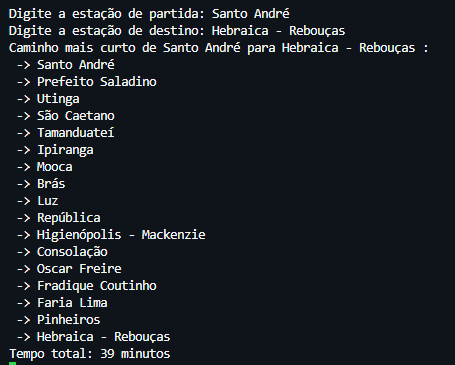

# Projeto: Grafos de Estações de Trem/Metrô de São Paulo

Este projeto é destinado à prática de grafos em Python, utilizando como caso de estudo a rede de estações de trem e metrô de São Paulo. O principal objetivo é armazenar todas as estações em um grafo e implementar um programa para descobrir o caminho mais curto entre duas estações.


## Funcionalidades

- Armazenamento de todas as estações de trem e metrô de São Paulo em um grafo.
- Implementação de algoritmos para encontrar o caminho mais curto entre duas estações.


## Estrutura do Projeto

```bash
/
├── data/
│   ├── data.json            # Arquivo JSON com o nome das estações
├── domain/
│   ├── Graph.py             # Classe com métodos do grafo
│   ├── Station.py   
├── utils/
│   ├── utils.py             # Arquivo com funções utilitárias
├── run.py                   # Arquivo executável
├── README.md                # Este arquivo
└── requirements.txt         # Dependências do projeto
```
    
## Como Utilizar

- Python instalado
- Instalar dependências do projeto:

```bash
pip install -r requirements.txt
```

- Executar projeto:
```bash
python run.py
```




## Autores

- [@KauanCavazani](https://www.github.com/KauanCavazani)

